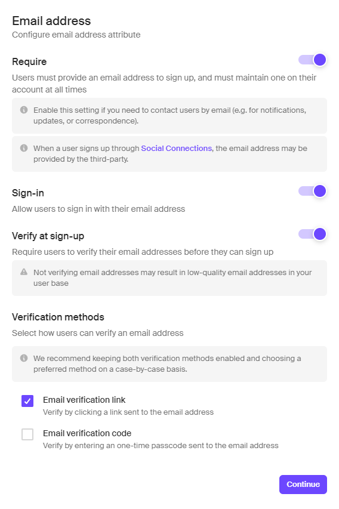
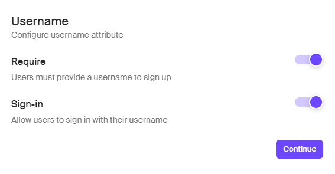
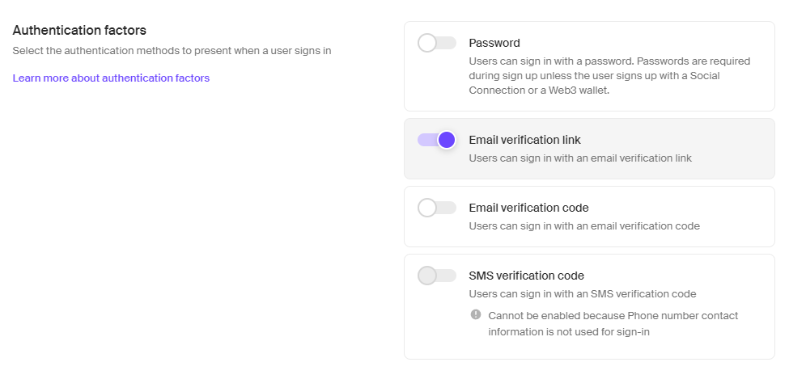
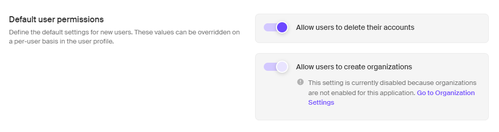

# **Next.JS 14 Template**

This is a template for Next.JS 14 with TypeScript. It is also configured with the following:

-   [ESLint](https://eslint.org/) : Linting for JavaScript and TypeScript.
-   [Prettier](https://prettier.io/) : Enforces a consistent code style.
-   [TailwindCSS](https://tailwindcss.com/) : Utility-first CSS framework.
-   [NextUI v2](https://nextui.org/) : Easy to use React UI Library.
-   [PlanetScale MySQL](https://planetscale.com/) : MySQL Database.
-   [Drizzle ORM](https://orm.drizzle.team/) : ORM for SQL Databases.
-   [Clerk](https://clerk.dev/) : Authentication and User Management.
-   [Upstash Redis](https://upstash.com/) : Redis Database for Caching, powered by Upstash.
-   [Upstash Rate Limiting](https://upstash.com/) : Rate Limiting for API Routes, powered by Upstash.
-   [SVIX](https://svix.com/) : Webhooks for the Web.
-   [Zustand](https://zustand-demo.pmnd.rs/) : Global State Management.
-   [React Query / Tanstack Query](https://tanstack.com/query/latest) : Data Fetching and Caching.
-   [React Hook Form](https://react-hook-form.com/) : Form Validation.
-   [React Hot Toast](https://react-hot-toast.com/) : Toast Notifications.
-   [Vercel Analytics](https://vercel.com/docs/analytics) : Analytics for Vercel.
-   [Icons w/ Lucide Icons](https://lucide.dev/) : Icons for the Web.
-   [UploadThing](https://uploadthing.com/) : Pre-built Upload Dropzone.
-   [Pre-built Upload Dropzone](https://react-dropzone.js.org/) : Styled & pre-configured Dropzone.

## Getting Started

### 1. Clone the repository

```bash
git clone https://github.com/itsdrvgo/nextjs-14-template.git
```

### 2. Install dependencies

-   Using [pnpm](https://pnpm.io/):

```bash
pnpm install
```

-   Using [Yarn](https://yarnpkg.com/):

```bash
yarn install
```

-   Using [npm](https://www.npmjs.com/):

```bash
npm install
```

### 3. Configure the environment variables

-   Copy the `.env.example` file and rename it to `.env`.
-   Fill in the environment variables.

### 4. Configure the database

-   Create a database on [PlanetScale](https://planetscale.com/).
-   Get the database credentials and fill them in the `.env` file.
-   Push the database schema to PlanetScale using the following command :

    ```bash
    pnpm db:push
    ```

### 5. Configure Clerk

-   Create a Clerk account and a Clerk application.
-   Get the Clerk API Key and fill it in the `.env` file.
-   Get the Clerk Frontend API Key and fill it in the `.env` file.
-   From `Webhooks` in the Clerk Dashboard, create a new Endpoint and subscribe to the following events :

    -   `user.created`
    -   `user.updated`
    -   `user.deleted`

-   Get the Endpoint Secret Key and fill it in the `.env` file inside `SVIX_SECRET`.
-   From `User & Authentication` in the Clerk Dashboard, enable the following features :

    -   `Email Address`
        
    -   `Username`
        
    -   `Email Verification Link` from `Authentication factors`
        
    -   `Allow users to delete their accounts` from `Default user permissions`
        

### 6. Configure HTTPS for development

-   Install [ngrok](https://ngrok.com/).
-   From your terminal, navigate to the directory where you installed ngrok.
-   Run the following command :

```bash
ngrok http 3000
```

or

```bash
./ngrok http 3000
```

-   Copy the HTTPS URL and go to the `Webhooks` section in the Clerk Dashboard.
-   Paste the HTTPS URL in the `Endpoint URL` field and add `/api/users` at the end.
-   The final URL should look like this : `https://<random-string>.ngrok.io/api/users`.

### 7. Configure Upstash

-   Create an Upstash account and a Redis database.
-   Get the Redis URL and Token and fill them in the `.env` file.

### 8. Start the development server

-   Using [pnpm](https://pnpm.io/):

```bash
pnpm dev
```

-   Using [Yarn](https://yarnpkg.com/):

```bash
yarn dev
```

-   Using [npm](https://www.npmjs.com/):

```bash
npm run dev
```

### 9. Start building your app

-   Start building your app by editing the files in the `app` directory.
-   You can also edit the files in the `components` directory to add more functionality to your app.
-   You can create new functions, schemas, validation methods and more in the `lib` directory.

### 10. Test Build

-   Build the app using the following command :

```bash
pnpm build
```

-   Start the app using the following command :

```bash
pnpm start
```

-   Open the app in your browser at `http://localhost:3000`.

## Community

Join the [DRVGO Discord Server](https://itsdrvgo.me/support) to connect with the community and get help with your projects.

## License

This project is licensed under the [MIT License](LICENSE).

## Let's Connect

[](https://instagram.com/itsdrvgo)
[](https://linkedin.com/in/itsdrvgo)
[](https://twitch.tv/itsdrvgo)
[](https://twitter.com/itsdrvgo)
[](https://youtube.com/@itsdrvgodev)
